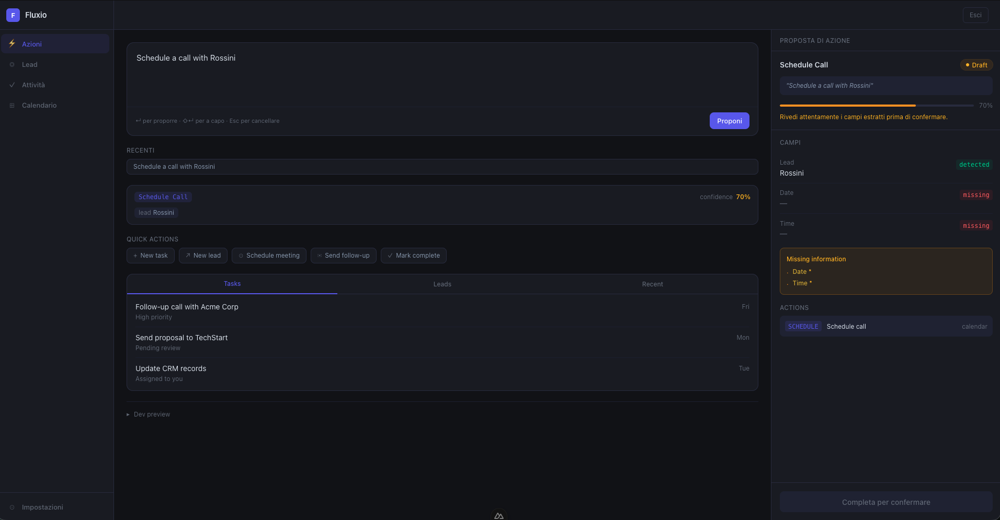
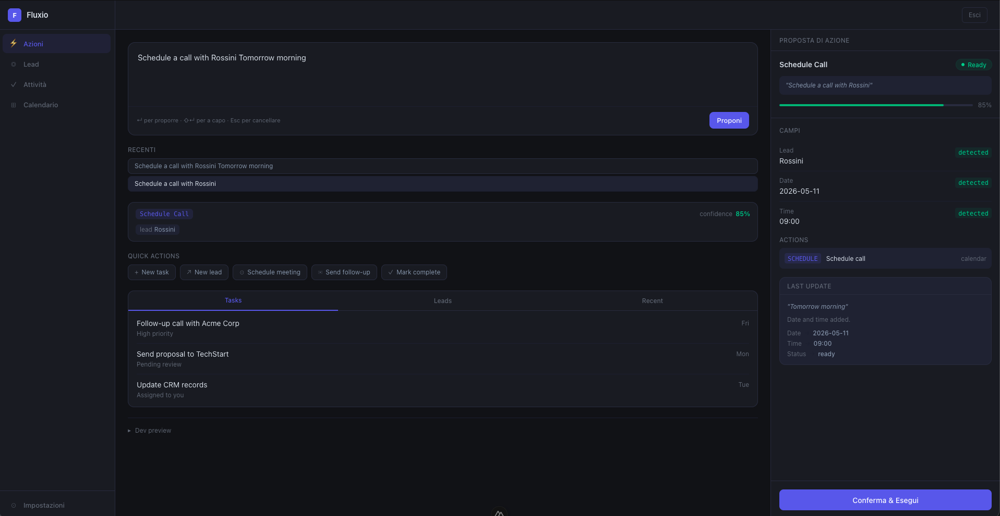
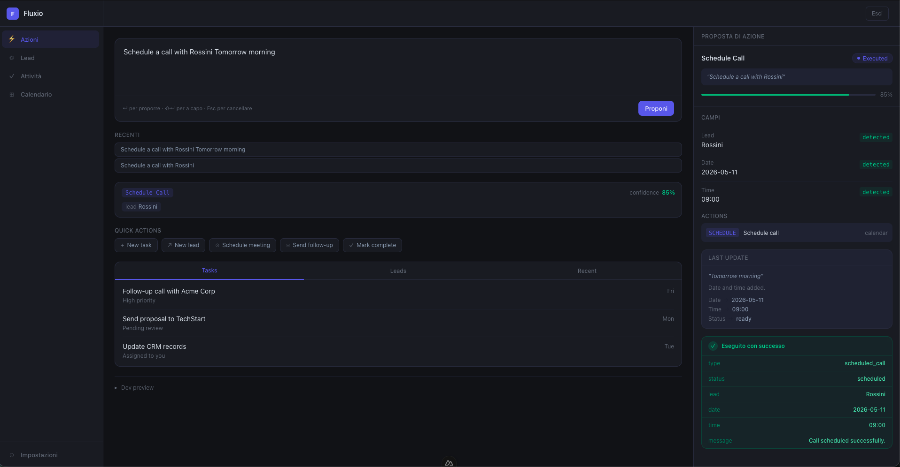
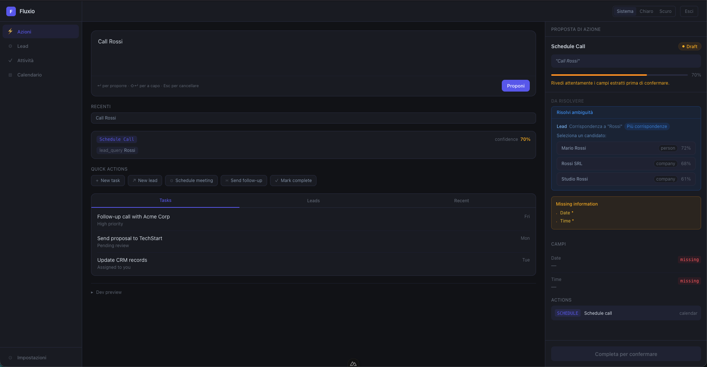
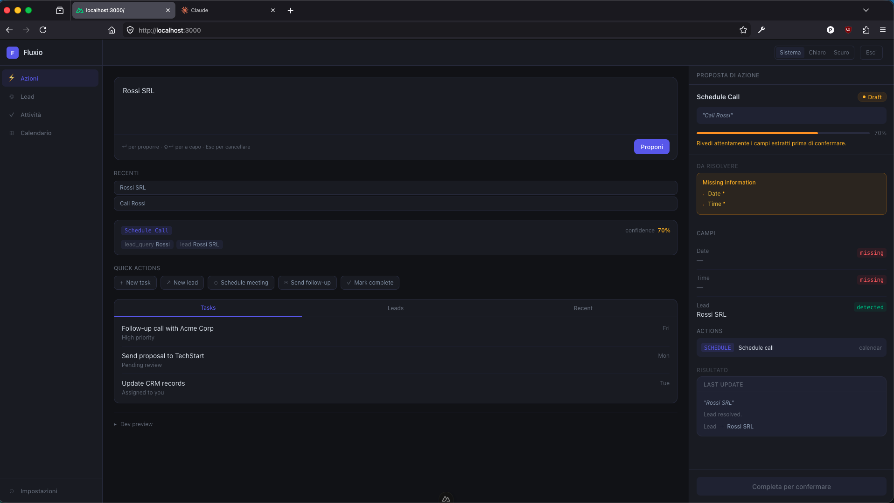
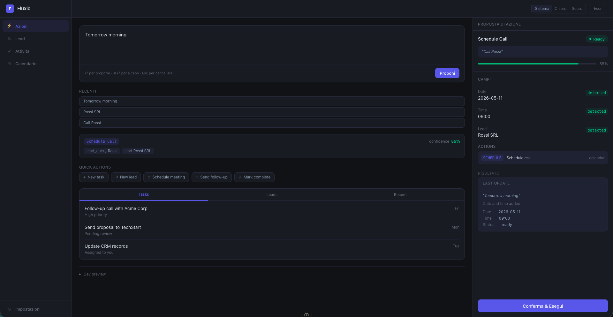
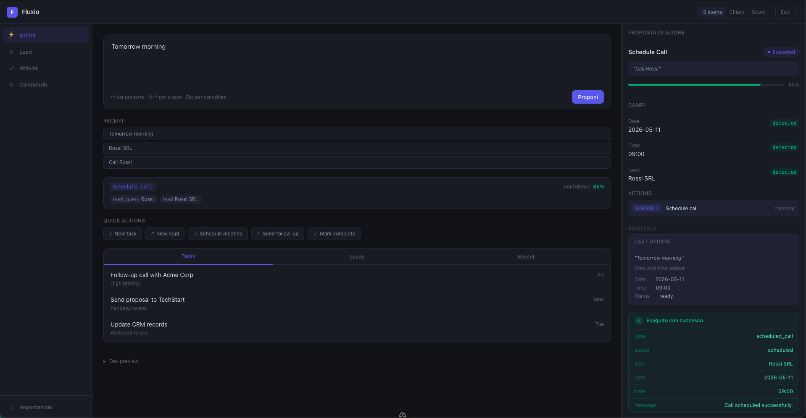

# Fluxio

Proposal-driven operational CRM/ERP prototype exploring controlled and explainable business execution through structured Action Proposals.

Fluxio is NOT:
- a chatbot
- an autonomous AI agent
- a dashboard-heavy ERP
- a generic AI wrapper

Fluxio is:
- proposal-centric
- ambiguity-aware
- refinement-oriented
- deterministic-first
- execution-controlled

---

# Core Idea

Traditional business software usually follows:

```text id="w7n2ps"
User → Form → Validation → Save
```

Many AI systems follow:

```text id="x4k8mb"
User → AI → Execute
```

Fluxio explores a different model:

```text id="q6v1rc"
User
→ Natural Language
→ Action Proposal
→ Proposal Refinement
→ Validation
→ Confirmation
→ Execution
```

Natural language is NEVER executed directly.

Every command becomes a structured proposal that must be:
- reviewable
- refinable
- explainable
- explicitly confirmed

before execution.

The proposal is the authoritative operational object.

---

# Architectural Invariants

These rules define Fluxio.

- Proposals are authoritative
- Natural language never executes directly
- Refinements mutate existing proposals
- Proposal continuity is preserved
- Ambiguities remain explicit
- Execution requires confirmation
- Proposal mutations remain explainable
- AI output remains advisory
- Execution stays deterministic

Fluxio intentionally prioritizes:
- operational clarity
- explainability
- controlled execution
- proposal transparency

over:
- blind automation
- assistant realism
- autonomous behavior

---

# Why Proposal-Driven UX

Fluxio treats ambiguity and uncertainty as operational states.

The system intentionally exposes:
- ambiguities
- missing information
- low-confidence interpretations
- proposal mutations
- execution consequences

The goal is NOT:

```text id="m5x9tn"
AI autonomy
```

The goal is:

```text id="d3q7vk"
safe, explainable and controllable
proposal-driven business interaction
```

---

# Proposal Lifecycle

Core lifecycle:

```text id="j8w4qs"
Natural Language
→ Intent Interpretation
→ Entity Extraction
→ Entity Resolution
→ Action Proposal
→ Proposal Refinement
→ Validation
→ Confirmation
→ Execution
```

Current proposal states:

```text id="u9m1pr"
draft
→ ready
→ confirmed
→ executed / failed
```

The SAME proposal evolves over time.

Conversation exists ONLY to improve proposal state.

---

# Proposal Mutation Semantics

Fluxio supports:

```text id="b7n4zk"
controlled proposal mutation semantics
```

Refinements are NOT generic chat replies.

Refinements mutate proposal state explicitly.

Current supported mutation operations:
- replace
- append
- remove
- clear
- replace_target

Examples:

```text id="h2q8tm"
Move it to Friday
At 10:30
Add Mario too
Remove Luca
Replace Mario with Marco
```

Fluxio tracks:
- what changed
- what remained unchanged
- proposal continuity
- readiness transitions
- ambiguity evolution

The UX should communicate:

```text id="r5k1vx"
"The proposal evolved."
```

NOT:

```text id="f6z3mn"
"The assistant replied."
```

---

# Ambiguity-Aware UX

Fluxio treats ambiguity as a first-class operational concept.

The system never silently chooses entities.

Example:

```text id="n4t7wj"
Call Rossi
```

Possible matches:
- Mario Rossi
- Rossi SRL
- Studio Rossi

Instead of hallucinating certainty, Fluxio:
- exposes ambiguity
- blocks execution
- preserves proposal continuity
- supports refinement

Example refinement flow:

```text id="p2x8qa"
Schedule a meeting with Rossi tomorrow morning
→ ambiguity detected

The second one
→ ambiguity resolved

Move it to Friday at 10:30
→ proposal mutated

Add Mario too
→ participant appended
```

---

# Current UX Direction

Fluxio frontend is intentionally:
- proposal-centric
- operational
- refinement-oriented
- confirmation-first
- future voice-friendly

Fluxio is NOT:
- a generic AI chat
- a conversational assistant
- an autonomous workflow engine

The proposal rail remains the operational center of the interface.

---

# UX Screenshots

## Initial Proposal Generation

<!-- PLACEHOLDER SCREENSHOT -->
<!-- Use: Action01.png -->



---

## Proposal Refinement

<!-- PLACEHOLDER SCREENSHOT -->
<!-- Use: Action02.png -->



---

## Successful Execution

<!-- PLACEHOLDER SCREENSHOT -->
<!-- Use: Action03.png -->



---

## Ambiguity Resolution

<!-- PLACEHOLDER SCREENSHOT -->
<!-- Use: screen01.png -->



---

## Proposal Mutation Flow

<!-- PLACEHOLDER SCREENSHOT -->
<!-- Use: screen02.png -->



---

## Ready Proposal

<!-- PLACEHOLDER SCREENSHOT -->
<!-- Use: screen03.png -->



---

## Executed Operational Flow

<!-- PLACEHOLDER SCREENSHOT -->
<!-- Use: screen04.png -->



---

# Architecture

## Modular Monolith

Fluxio is built as a modular monolith with explicit boundaries.

```text id="s4m7vb"
fluxio/
├── apps/
│   ├── api/
│   └── web/
│
├── packages/
│   ├── Core/
│   ├── Identity/
│   ├── Leads/
│   ├── Tasks/
│   ├── Actions/
│   ├── Calendar/
│   ├── Analytics/
│   └── Notifications/
```

Core principle:

```text id="g1n8qk"
Modularize first, microservice later.
```

Each module owns:
- services
- models
- routes
- migrations
- business rules
- events

---

# Actions Module

The `Actions` module is the operational core of Fluxio.

Responsibilities:
- intent interpretation
- proposal lifecycle
- proposal mutation semantics
- ambiguity handling
- execution orchestration
- execution safety
- refinement tracking
- entity resolution
- mutation legality (intent capability model)

Current capabilities:
- proposal continuity
- contextual refinements
- collection mutations
- proposal-local references
- mutation summaries
- operational intent registry
- deterministic execution flows
- interpretation provider abstraction
- normalized command validation
- entity resolution layer
- intent capability model (per-intent mutation/refinement legality)
- localized capability labels in the proposal payload
- refinement warning deduplication

---

# Example Operational Flow

Input:

```text id="x8k3pb"
Schedule a meeting with Rossi tomorrow morning
```

System:
- detects ambiguity
- extracts date/time
- creates proposal
- blocks execution

Refinement:

```text id="m4v1tn"
The second one
```

System:
- resolves ambiguity
- preserves proposal continuity
- proposal becomes `ready`

Refinement:

```text id="c7q5zx"
Move it to Friday at 10:30
```

System:
- mutates SAME proposal
- replaces date/time
- preserves unrelated fields

Execution:

```text id="u5n2wr"
Confirm
→ Execute
```

Result:
- operation executed
- execution result rendered
- proposal becomes immutable

---

# Entity Resolution Layer

Fluxio now includes a dedicated entity resolution architecture.

Current structure:

```text id="b9m6qv"
EntityResolverInterface
→ EntityResolverRegistry
→ Resolver implementations
→ ResolutionResult
```

Current implemented resolver:
- `LeadEntityResolver`

Current behaviors:
- deterministic scoring
- confidence ordering
- ambiguity generation
- auto-resolution thresholds
- proposal-scoped refinement

---

# Provider Validation Boundary

Every interpreted command is validated before entering the proposal lifecycle.

Current flow:

```text id="q3w8tp"
Interpretation Provider
→ NormalizedCommand
→ Validation Layer
→ Proposal Lifecycle
```

Current validation includes:
- intent validation
- confidence validation
- entity validation
- requirement compatibility checks

Malformed provider output is rejected before proposal creation.

This protects:
- proposal integrity
- frontend stability
- deterministic lifecycle semantics

---

# Event-Driven Architecture

Modules communicate through:
- events
- listeners
- jobs

Examples:
- `ActionExecuted`
- `LeadCreated`
- `TaskCompleted`

Direct cross-domain coupling is intentionally minimized.

---

# Technology Stack

## Backend

- Laravel
- PostgreSQL
- Modular monolith architecture
- Event-driven design
- Standardized API responses

## Frontend

- Nuxt 4
- Vue 3
- Composition API
- Tailwind CSS v4
- TypeScript
- i18n

---

# API Design

Fluxio exposes a standardized JSON API.

## Success Response

```json id="r6m2zc"
{
  "success": true,
  "message": "Operation completed successfully.",
  "data": {}
}
```

---

## Error Response

```json id="w1q7vn"
{
  "success": false,
  "message": "Error message."
}
```

---

## Validation Error

```json id="f8t4pk"
{
  "success": false,
  "message": "Validation failed.",
  "errors": {
    "field": ["Validation message"]
  }
}
```

---

# Localization

Fluxio is multilingual from the beginning.

Current languages:
- English
- Italian

Planned:
- German

Current parser implementation remains English-first.

---

# Current Project Status

Fluxio already includes:
- modular backend architecture
- standardized API layer
- proposal lifecycle
- proposal mutation semantics
- ambiguity-aware refinement
- operational intent registry
- contextual mutations
- collection mutations
- proposal-local references
- deterministic execution flows
- proposal-centric frontend shell
- ambiguity-aware UX
- execution rendering
- responsive operational UI
- entity resolution layer
- interpretation provider abstraction
- normalized command validation

Current implemented operational intents:
- `create_task`
- `schedule_call`
- `schedule_meeting`
- `assign_lead`
- `prepare_contract_from_quote`

---

# Current Frontend

Implemented frontend capabilities:
- command composer
- proposal rail
- mutation rendering
- ambiguity rendering
- confidence-aware UX
- proposal continuity UX
- execution rendering
- contextual refinements
- capability panel (operational metadata from the backend)
- contextual refinement hints (gated by capabilities and proposal state)
- locale-aware API calls (`Accept-Language`)
- responsive/mobile-safe shell
- dark/light/system themes
- i18n support

Frontend direction remains:
- proposal-centric
- operational
- deterministic-first
- non-chatbot

---

# Not Yet Implemented

- LLM-backed interpretation provider in the proposal runtime
  (the transport client and structured-output validator exist as sandbox
  infrastructure but are not wired into `ActionInterpreterService`)
- Semantic entity search
- Advanced resolver ranking
- Voice workflows
- Multi-step orchestration
- Multi-user collaboration
- Advanced calendar coordination
- Realtime collaboration
- Production deployment pipeline

---

# LLM Strategy

Fluxio is deterministic-first and validation-first.

Current runtime interpretation uses:
- rule-based interpretation (`DeterministicInterpretationProvider`)
- deterministic proposal mutations
- structured validation (`NormalizedCommandValidator`)
- explicit execution control

Sandbox infrastructure for future LLM-backed interpretation already
exists in `packages/Actions/src/Llm/` and is not wired into the runtime:

- `LlmClientInterface` + `OllamaLlmClient` — generic LLM transport
  abstraction (Phase 2)
- `LlmStructuredOutputValidator` + `InvalidLlmStructuredOutputException`
  — provider-level JSON contract validation that any future LLM provider
  must pass before producing a `NormalizedCommand` (Phase 3)

The deterministic provider remains authoritative. Any future LLM
integration will:

- assist interpretation only (intent / entity extraction)
- still go through `NormalizedCommandValidator`
- still go through `IntentCapabilityRegistry`
- never own proposal state
- never execute, confirm, or mutate proposals directly

Core principle:

```text id="n2v5rk"
LLM assists interpretation.
Fluxio controls execution.
```

The detailed contract is in [`.docs/llm-interpretation-contract.md`](.docs/llm-interpretation-contract.md).

Possible future runtime providers:
- Ollama
- Qwen
- local lightweight models

---

# Documentation

Public, versioned documentation lives in `docs/`. Internal architectural
notes and working documents live in `.docs/`.

## Public documentation (`docs/`)

- [Architecture](docs/architecture.md)
- [Frontend Vision](docs/frontend-vision.md)
- [Proposal Lifecycle](docs/proposal-lifecycle.md)
- [API Response Standard](docs/api-response-standard.md)
- [Getting Started](docs/getting-started.md)

## Internal notes (`.docs/`)

- [Backend Current State](.docs/backend-current-state.md)
- [Development Plan](.docs/development-plan.md)
- [LLM Interpretation Contract](.docs/llm-interpretation-contract.md)

---

# Quick Start

## Requirements

- PHP 8.3+
- Composer
- Node.js 20+
- PostgreSQL

---

## Clone Repository

```bash
git clone https://github.com/anfibes/fluxio.git
cd fluxio
```

---

## Backend

```bash
cd apps/api

composer install

cp .env.example .env

php artisan key:generate

php artisan migrate

php artisan serve
```

---

## Frontend

```bash
cd apps/web

npm install

npm run dev
```

---

# Why Fluxio Exists

Fluxio started as an exploration of whether business software could evolve beyond:
- CRUD-heavy workflows
- dashboard-first ERP interfaces
- generic AI chat experiences

The project focuses on:
- proposal-driven operational interaction
- deterministic execution
- ambiguity-aware workflows
- explainable proposal lifecycle semantics

The goal is not to automate human decisions away.

The goal is to explore software that helps operators work through:
- structured proposals
- controlled refinements
- explicit confirmations
- safe operational execution

while preserving:
- clarity
- control
- explainability
- operational trust

---

# Development Philosophy

Fluxio evolves through:
- small steps
- deterministic workflows
- test-driven iterations
- operational UX experiments
- explainable proposal semantics

The project intentionally prioritizes:
- maintainability
- explicit behavior
- proposal transparency
- execution safety
- architectural clarity

Avoided intentionally:
- hidden AI behavior
- opaque automation
- giant assistant abstractions
- premature orchestration complexity

---

# Project Goal

Fluxio is currently NOT production-ready.

The project exists to explore:
- proposal-driven operational UX
- ambiguity-aware workflows
- explainable proposal interaction
- deterministic proposal mutation semantics
- future enterprise interaction models

while demonstrating:
- modular backend architecture
- scalable frontend structure
- proposal-centric UX
- maintainable domain separation
- controlled operational workflows

---

# Author

Fluxio is designed and developed by Paolo Servilio.

GitHub:
https://github.com/anfibes

---

# License

MIT